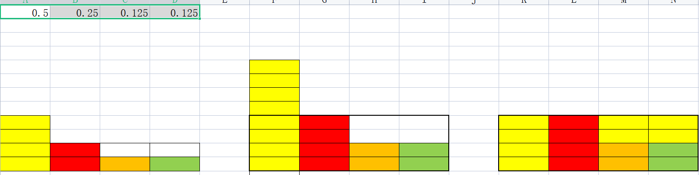

## 别名方法 (Alias method)

Alias Method 是时间复杂度为O(1)的离散采样算法。

### 方法

#### 目的

构造一个 $N * 1$的矩形，使得每一列都会100%命中数据。

#### 建表过程（Alias table）

将每个事件的概率乘以$N$,将概率大于1的补到概率小于1的事件中，使得每一列的概率之和为1且最多只有两种事件。返回$prob[]$表示概列的概率，以及$conterEvent[]$记录补充概率的事件。



#### 求概率过程

* 先求列的概率$[1,N]$
* 再求$[0,1]$的概率看属于哪种事件

### 代码

``` java
/**
 * 别名方法
 *
 * @author huang jiahui
 * @date 2022/6/13 10:30
 */
public class AliasMethod<T> {

    private final double[] probabilities;

    private final T[] event;

    private ArrayList<T> counterEvent;
    private ArrayList<Double> probResult;
    private int n;
    private Random random;

    public AliasMethod(T[]event,double[] probabilities) {
        this.event = event;
        this.probabilities = probabilities;
        creatAliasTable();
    }

    private void creatAliasTable() {
        this.n = this.event.length;
        LinkedList<Node<T>> smallList = new LinkedList<>();
        LinkedList<Node<T>> largeList = new LinkedList<>();

        random = new Random();

        this.counterEvent = new ArrayList<>(n);
        this.probResult = new ArrayList<>(n);

        for (int i = 0; i < n; i++) {
            double tmp = this.probabilities[i] * n;
            Node<T> node = new Node<>(event[i], tmp, i);

            this.probResult.add(tmp);
            this.counterEvent.add(node.event);

            if (tmp < 1.0) {
                smallList.add(node);
            } else if (tmp > 1.0) {
                largeList.add(node);
            }
        }

        while (!largeList.isEmpty() && !smallList.isEmpty()) {
            Node<T> large = largeList.pollLast();
            Node<T> small = smallList.pollLast();

            large.probability += small.probability - 1;

            this.probResult.set(small.index, small.probability);
            this.probResult.set(large.index, large.probability);

            this.counterEvent.set(small.index, large.event);

            if (large.probability < 1) {
                smallList.add(large);
            } else if (large.probability > 1) {
                largeList.add(large);
            }
        }
    }

    public T generate(){
        int first = this.random.nextInt(this.n);

        if (this.probResult.get(first) != 1) {
            double second = this.random.nextDouble();

            if (second > this.probResult.get(first)) {
                return this.counterEvent.get(first);
            }
        }

       return this.event[first];
    }

    static class Node<T> {
        T event;
        double probability;
        int index;

        public Node(T event, double probability, int index) {
            this.event = event;
            this.probability = probability;
            this.index = index;
        }
    }
}
```

